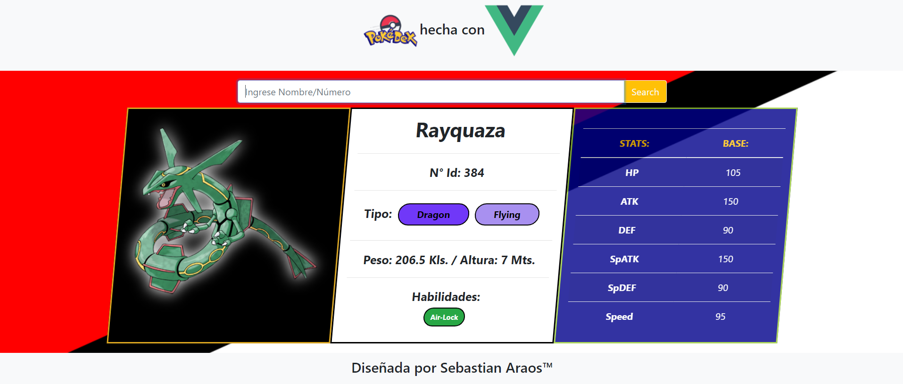

<<<<<<< HEAD

# desafio_pokeguia

## Project setup
```
npm install
```

### Compiles and hot-reloads for development
```
npm run serve
```

### Compiles and minifies for production
```
npm run build
```

### Lints and fixes files
```
npm run lint
```

### Customize configuration
See [Configuration Reference](https://cli.vuejs.org/config/).
=======
# PokedexVueCli
Ejercicio (Desafío Curso) "Pokedex realizada con Vue-Cli
>>>>>>> c06951e84dd70f3e62ad0fc04afad7357822d005
